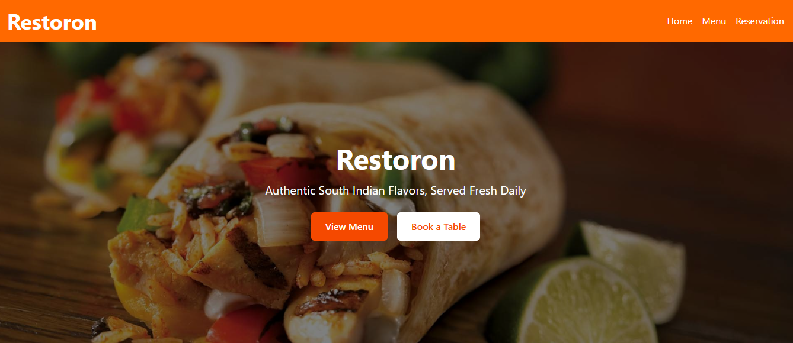
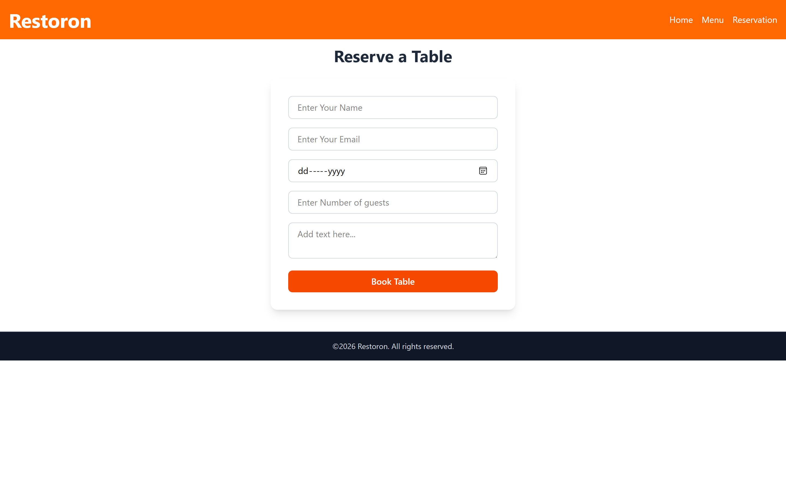
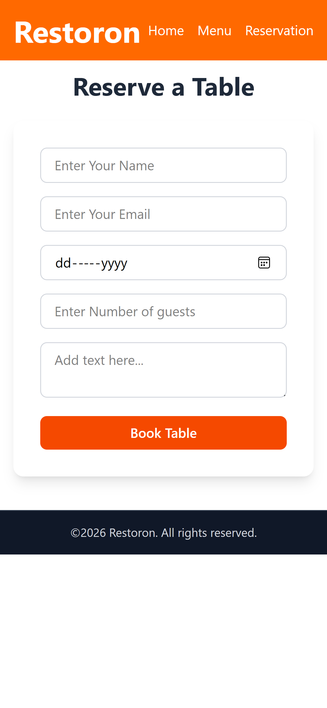
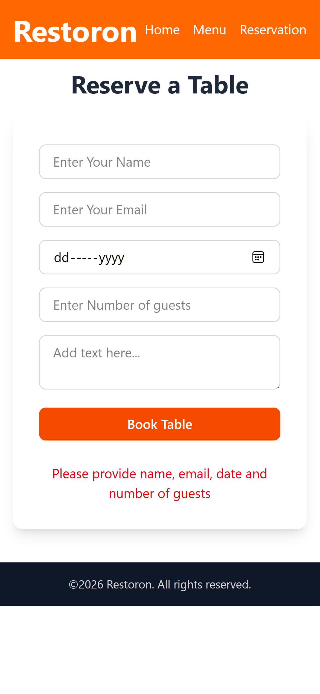
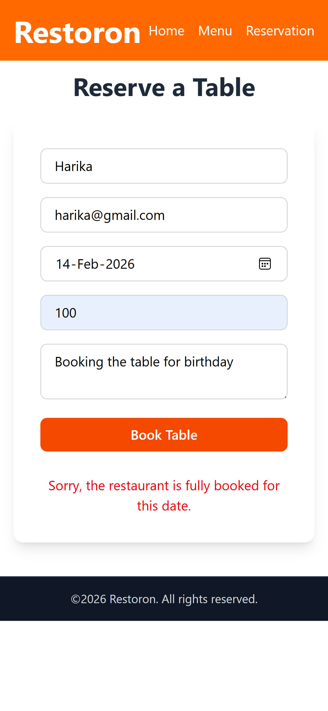

# 🍽️ Restoron Client – Restaurant Reservation Frontend

Frontend application for **Restoron**, a full-stack restaurant reservation system.

Built with React (Vite) and deployed on Vercel.

---

## 🚀 Live Demo

🌐 Frontend: https://restoron-client.vercel.app  
🔗 Backend API: https://restoron-api.onrender.com  

---

## 📌 Features

### 👨‍🍳 Customer Experience
- View dynamic restaurant menu
- Make table reservations
- Real-time availability validation
- Responsive mobile-first design
- Clean and modern UI

---

## 🛠️ Tech Stack

- React.js (Vite)
- React Router DOM
- Tailwind CSS
- Axios

---

## 🏗️ Architecture

React Client → Express REST API → Supabase (PostgreSQL)

The frontend communicates with the backend REST API for:
- Fetching menu items
- Creating reservations

---

## 📂 Project Structure

restoron-client/
│
├── src/
│   ├── api/
│   │   └── api.js
│   ├── components/
│   ├── pages/
│   ├── App.jsx
│   └── main.jsx
│
├── screenshots/
│   ├── home.png
│   ├── menu.png
│   ├── reservation-form.png
│   ├── mobile-home.png
│   ├── mobile-menu.png
│   ├── mobile-reservation-form.png
│   ├── validation-details.png
│   └── validation-overbooking.png
│
├── package.json
├── README.md
└── .env

---

## 🔐 Environment Variables

Create a `.env` file in the root directory:

VITE_API_URL=https://restoron-api.onrender.com

⚠️ Do not commit your `.env` file.

For production (Vercel), configure the same variable in:

Vercel → Project Settings → Environment Variables

---

## 📸 Screenshots

### 🏠 Homepage (Desktop)

### 🍽 Menu Page (Desktop)

### 📅 Reservation Form (Desktop)

### 📱 Mobile View

### 🏠 Homepage (Mobile)

### 🍽 Menu Page (Mobile)

### 📅 Reservation Form (Mobile)

### 🛡️ Form Validation (Desktop & Mobile)

- **Missing details**: Validation error when required fields are empty  

- **Overbooking prevention**: Error triggered when capacity is full  

---

## ⚙️ Installation & Setup

### 1️⃣ Clone Repository

git clone https://github.com/Mahalaxmi-Komuravelly/restoron-client.git

cd restoron-client

### 2️⃣ Install Dependencies

npm install

### 3️⃣ Run Development Server

npm run dev

---

## 📡 API Endpoints Used

### Menu
`GET /api/menu`

### Reservations
`POST /api/reservations`

---

## 👨‍💻 Author

**Mahalaxmi Komuravelly**  
Full Stack Web Developer  

GitHub: https://github.com/Mahalaxmi-Komuravelly  

---

## 📄 License

MIT License
